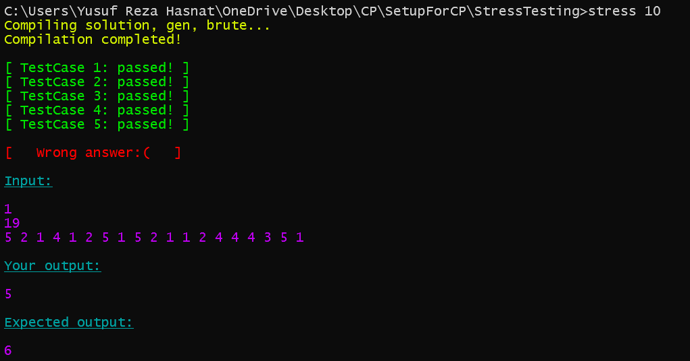

<h1 align="center">Stress Testing</h1>
A simple script which stress tests our solution with a brute force solution on randomly generated testcases, to find a possible failing testcase.<br>

### Usage
Clone this repository using git or download manually.<br>
For cloning the repository open your terminal and type `git clone https://github.com/hasnat0006/SetupForCP.git`

After cloning the repository, you can see 3 cpp files and 1 bat file in StreeTesting directory.
1. **brute.cpp** (for brute force solution)
2. **solution.cpp** (for optimized solution)
3. **gen.cpp** (for generating test cases)
4. **stress.bat** (for testing our code)

### How to generate test cases
To generate test cases, we can use the gen.cpp file. We just edit this `generate_test()` function as per our requirement.<br>
1. We need an array of size n;

```cpp
void generate_test() {
    int n = rand(1, 100);
    // it will return an interger in the range [1, 100]
    cout << n << endl; // if you want to print the size of the array
    cout << gen_array(n, -100, 100) << endl; 
    // it will return a vector with length n and elements in the range [-100, 100].
}
```
2. We need a tree with n nodes;

```cpp
void generate_test() {
    int n = rand(1, 100);
    cout << n << endl; // if you want to print the size of the tree
    cout << gen_tree(n) << endl; 
    // it will return a tree with n nodes.
}
```
3. We need a simple graph with n nodes and m edges;

```cpp
void generate_test() {
    int n = rand(1, 100);
    int m = rand(1, 100);
    cout << n << " " << m << endl; // if you want to print the no of nodes and edges
    cout << gen_simple_graph(n, m) << endl; 
    // it will return a simple connected graph with n nodes and m edges.
}
```
You can modify this file to generate test cases as per your requirements.

### How to use the script
1. Before running the script change **brute.cpp**, **solution.cpp**, and **gen.cpp** as per your requirement.
2. Open **Command Prompt** in  **StressTesting** directory.
3. To run the script 10 time, type `stress 10` in your **Command Prompt**.

Here is an example of the output of the script. It shows our solution.cpp file gives wrong ans in test case 6.<br>


In script you can change the color of the output as per your requirement. Just change the color code in the script. All the color codes are given in the script as shown below.<br>


To change color just change the color code in the script as shown below.
```bash
#Replace the colorName with the color you want to use.
call :echoColorName 
#e.g. we want to change the color from red to green
call :echoGreen
```
